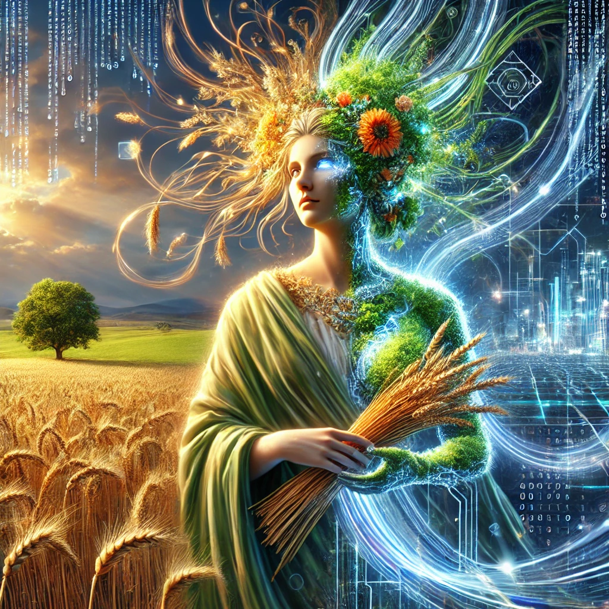

# 🌾 Demeter: Empowering Rural Farmers with Technology 🤖

**Demeter** (the goddess of agriculture) is a modern platform built to store and manage information about rural farmers and their crops.

## Notes

- There are system requirements? Yes, check [Specification](./docs/Specification.md)
- How to run in localhost? Check [localhost guide](./envs/localhost/README.md)
- What are the api routes? Check [Api Routes](./docs/api-routes.md)
- How to deploy the application? Check [deploy guide](./envs/hml/README.md)
- There are possible improvementes? Yes, check [Backlog](./docs/Backlog.md)
